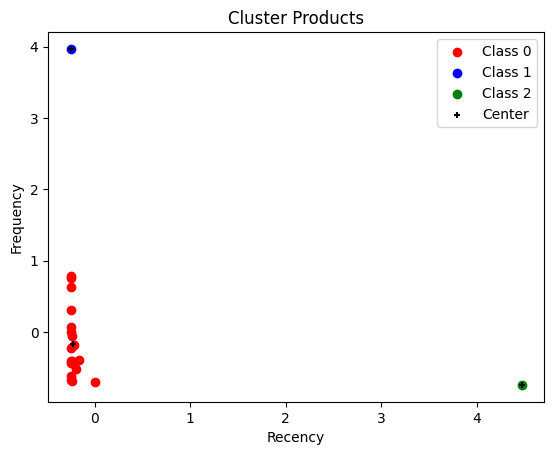

# BakerySegmentation
Use RFM Segmentation to know Bakery Product Salary
Result :
- Class 0  Medium Demand
- Class 1 High Demand
- Class 2 : Low Demand

RFM detail Clusters:

Product Name | Recency | Frequency | Monetary | Cluster 
----- |---------|-----------|----------|---------|
angbutter|0|3229|15499200|1
plain bread|0|1028|3598000|0
jam|5|249|373500|0
americano|0|513|2052000|0
croissant|0|1049|3671500|0
caffe latte|0|214|963000|0
tiramisu croissant|0|945|4536000|0
cacao deep|0|364|1456000|0
pain au chocolat|0|726|2541000|0
almond croissant|1|235|940000|0
milk tea|3|160|720000|0
gateau chocolat|2|210|840000|0
pandoro|2|394|1773000|0
cheese cake|0|92|460000|0
lemon ade|14|38|171000|0
orange pound|0|566|2547000|0
wiener|1|476|1190000|0
vanila latte|0|241|1084500|0
berry ade|0|55|247500|0
tiramisu|264|7|31500|2
merinque cookies|1|49|196000|0
